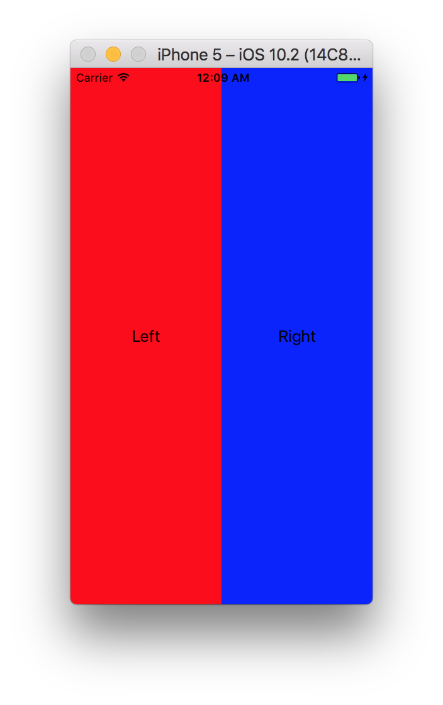
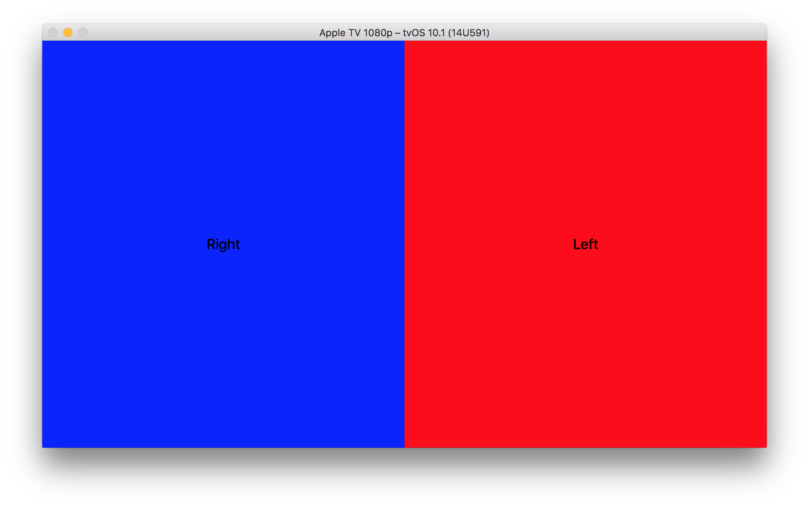

# Radar-31138095

tvOS ignores the value assigned to semanticContentAttribute of UIStackViews

· Open radar: https://openradar.appspot.com/31138095

# Description
Setting the value `forceRightToLeft` to the property `semanticContentAttribute` in an instance of UIStackView in tvOS does not have any effect. The views are anyway added from left to right.

# Steps
In this repo you can find two projects with exactly the same piece of code. One of them running in iOS and the other one in tvOS

In iOS, the views are added from right to left to the stack view, but in tvOS, on the other hand, they are added from left to right.

# Expected
The views are added from right to left in both operating systems, as documented

# Version:
tvOS 10.1
